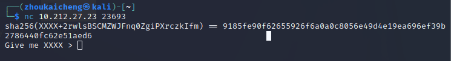

## chatgpt

穷举验证。比较懒脚本写的十分丑陋



```python
import hashlib
def sha(head):
    h = hashlib.sha256()
    h.update((head + tail).encode())
    str = h.hexdigest()
    if str == result:
        print(head)
        return head
    return 0
hashstr="sha256(XXXX+srwxZ1nUFH2Cl8qu) == 798421dfdb693f3aeac37918815512086b393ebdc002e6193ae6b06783e346f5"
chars = "ABCDEFGHIJKLMNOPQRSTUVWXYZ" + "abcdefghijklmnopqrstuvwxyz" + "0123456789" # A-Z a-z 0-9
tail = hashstr.split('+')[1][:28] # 原字符串的尾部
result = hashstr.split('==')[1].strip() # hash值
head=0
for ch1 in chars:
    if head != 0:
        break
    for ch2 in chars:
        if head != 0:
            break
        for ch3 in chars:
            if head != 0:
                break
            for ch4 in chars:
                head=sha(ch1 + ch2 + ch3 + ch4)
                if head!=0:
                    break
```

进入之后一步步先答题。


这里就随便举几个问题，有几个问题我一直没找到正确答案，反正够了五题就行

```text
Do you know the city where the CISCN-CTF finals will be held this year? Answer in English with the first letter capital
answer > Hefei
Do you know the city where we played CISCN-CTF finals last year? Answer in English with the first letter capital
answer > Beijing
Do you know the final place we've got in the *CTF 2022?
answer > 11
Do you know the amount of the prize for the team who get 1st place in the CTF we played last month in Hangzhou?
answer > 150000

```

**出题人住在六楼**，穷举出来了= =准备进行**offline attack**（x

之后会得到第一段flag

```纯文本
BUAACTF{C0Ngr@~tuLati0N5_Y0u_R~
```

解/pss，一开始一直想着石头剪刀布的选择环节有没有什么神奇的漏洞，后来出题人提醒了一下，石头剪刀布这块是不公平的，才想到去赌钱这块研究，稍微试了一下发现负数可以，-10000000000输完就变正的了


解/hard-pss，也是解了好久，输入字母什么的都"No hack"，之后再问了下出题人，提示了一下数据类型，Google了python数据类型发现把复数给忘了，-10000000000j，结束


flag为

```纯文本
BUAACTF{C0Ngr@~tuLati0N5_Y0u_R~4~r3a1_MA5Ter_of_0ur_s1llY_CH@tgpT__5_L0vvvvv3_fr0m_M1sc!}
```