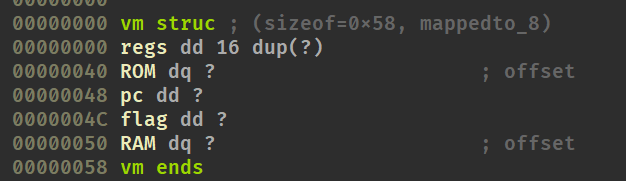
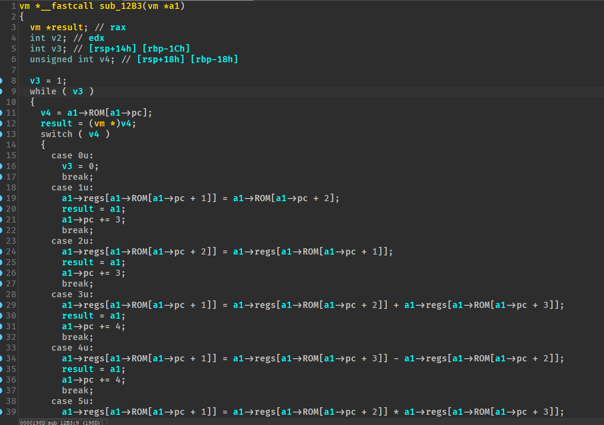

分析变量的行为以及所在偏移，在IDA里构建结构体

在反编译代码中修改类型，a1修改为`vm*`类型

接下来无论是调试还是静态分析都相对容易了

根据每个case看出对应的操作类型
```
1 LOAD 
2 MOVE
3 ADD
4 SUB
5 MUL
6 DIV
7 XOR
8 JMP
9 INPUT
10 CMP
11 JNE
12 LOADM
13 END
```
可以发现就是对输入的 flag 逐个异或 0xE9，异或回去即可