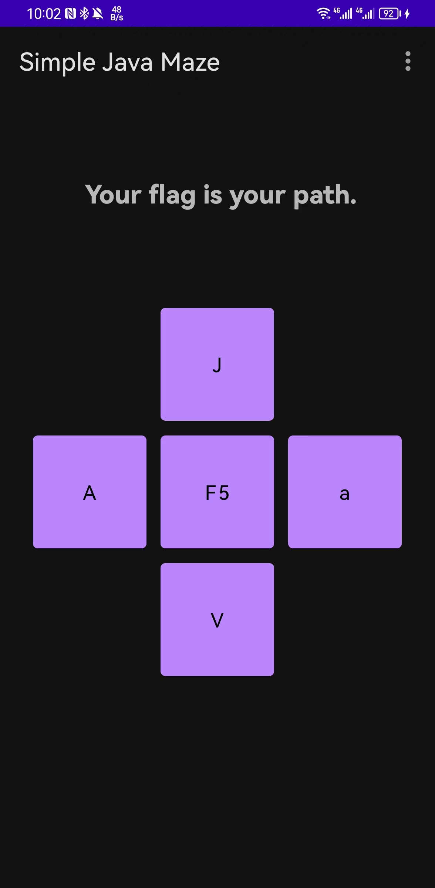
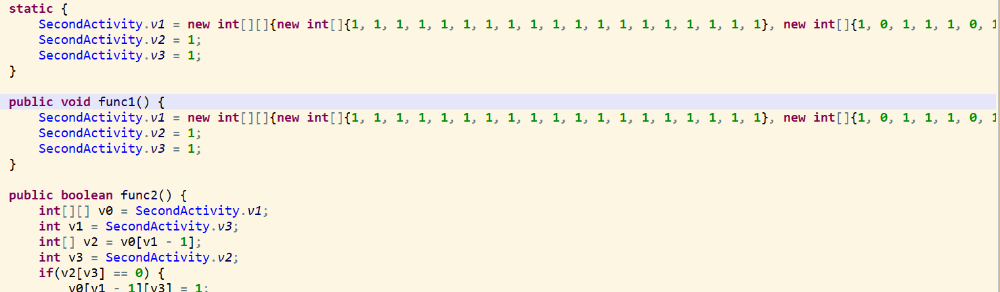
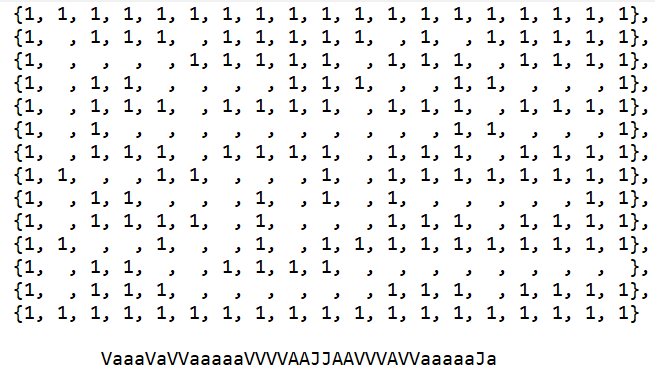

一道安卓逆向题，打开软件后

反编译后找到入口`secondActivity`，发现一个二维数组和处理两个数组索引变量的函数：

分析可知该迷宫中初始位置为`v1[1][1]`，成功判定点为`v1[11][11]`，1 是墙壁0是道路，且不能走已经走过的路；向上走会输出`J`，向下走会输出`V`，向左走会输出`A`，向右走会输出`a`，写脚本或直接看迷宫得出剩余flag。

所以最终flag为`flag{VaaaVaVVaaaaaVVVVAAJJAAVVVAVVaaaaaJa}`