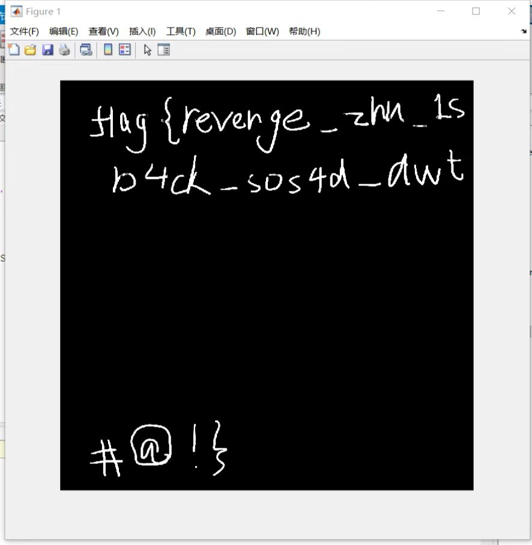

## zhuzhu's revenge

这次的gift里面没有了Img数据，按照脚本逆向就行。先逆向enc2


```python
from Crypto.Cipher import AES
from Crypto.Util.Padding import pad,unpad
from Crypto.Util.number import long_to_bytes
import os

with open('enc.png', 'rb') as f:
    data = f.read()
key = long_to_bytes(0x839fff08948936e7d78c5105dde1e95a)
print(AES.block_size)
print(key)
cipher = AES.new(key, AES.MODE_CBC,iv=b'\x00\x00\x00\x00\x00\x00\x00\x00\x00\x00\x00\x00\x00\x00\x00\x00')
decrypted_data = unpad(cipher.decrypt(data),AES.block_size)
with open('wm.png', 'wb') as f:
    f.write(decrypted_data)
```

由于不知道iv，按照CBC的解密规则，最后的16字节是解不出来的，不过没关系，png文件的前16字节是固定的，把16字节改一下就能得到wm.png


之后matlab逆向enc1.m就行


```matlab
[U,S,V]=svd(LL);
IW=imread('wm.png');
IW=im2double(IW);
[LL2,LH,HL,HH]=dwt2(IW,'haar');
S2=inv(U)*LL2*inv(V);
Sw=1.945525*(S2-S);
Sigma = diag(Sw);
A_reconstructed = Uw * diag(Sigma) * Vw';
imshow(A_reconstructed);
```

这里关于svd的逆向是问chatgpt出来的。（实在线性代数没学好


得到了



\*这里感谢一下马老师，因为我的matlab没有小波变换包，他的有，所以属于人肉调试器了。

